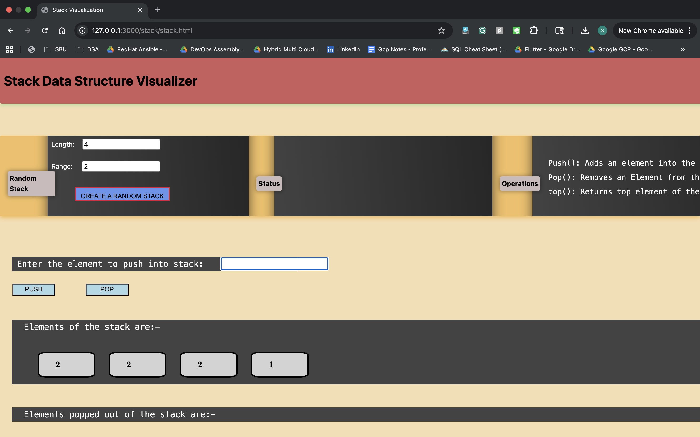
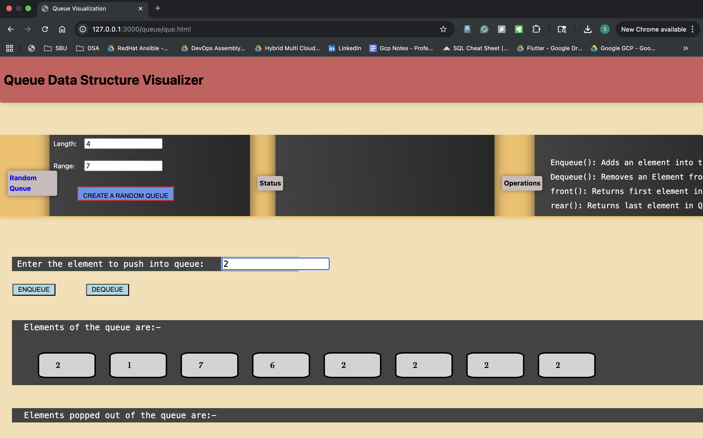
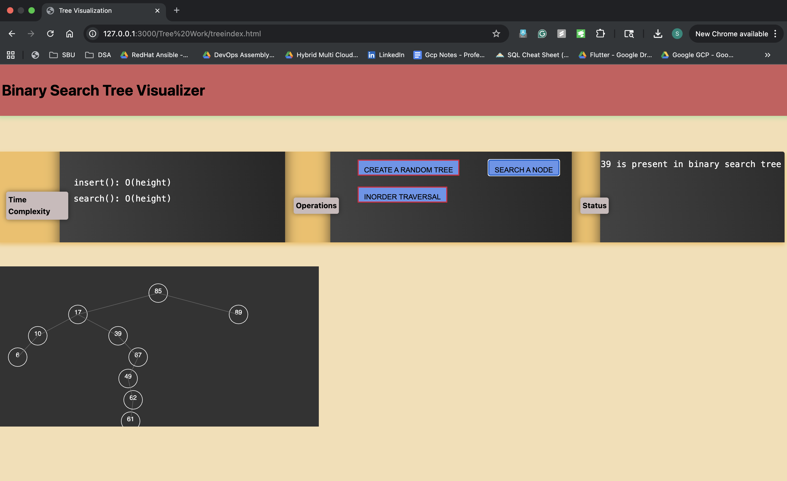
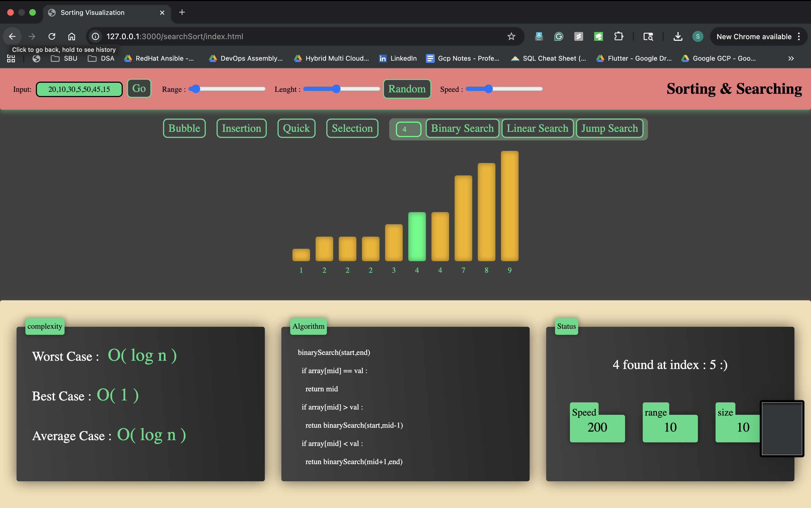
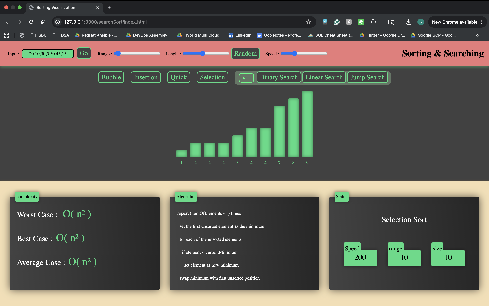
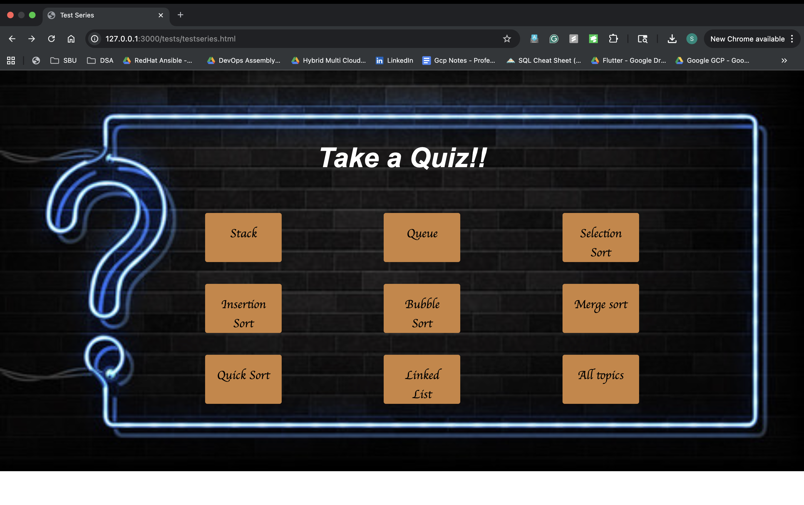
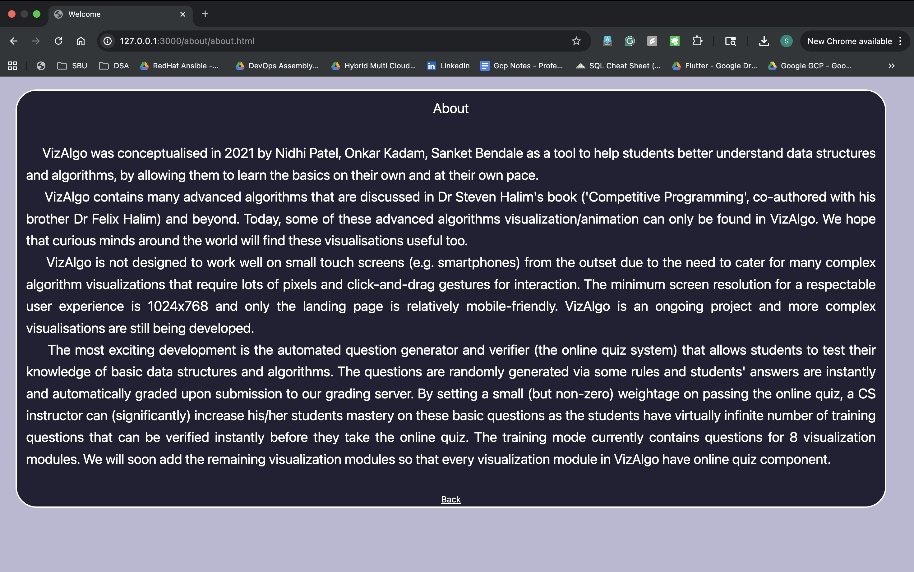

# 🧠 AlgoViz – Data Structure & Algorithm Visualizer

Visualising **data structures and algorithms through animation**.  
AlgoViz is a web platform that lets you **see** how core DS & Algo concepts work – step-by-step, with controls for input, speed, and operations.

---

## 🧾 Overview

AlgoViz focuses on:

- **Interactive visualizations** for core data structures and algorithms
- **Hands-on controls** (push / pop / enqueue / dequeue / insert / search)
- **Time-complexity panels** and algorithm pseudocode
- **Quiz / test series** to quickly check understanding
- A clean **landing page + explore hub** that links all modules

Everything runs completely in the browser using **HTML, CSS and JavaScript** (served via any simple static HTTP server).

---

## 🧱 Features & Modules

### 🏠 Landing page – `main_index.html`

- Branded header: **AlgoViz.com**
- Tagline: *“visualising data structures and algorithms through animation”*
- Short description of the platform and its goal (experiment + visualize).
- Primary **Explore** button leading to the visualizations hub.
- A dynamic **“Next Random Tip”** card showing small DS/Algo tips.

> Entry point URL (when served on port 3000):  
> `http://127.0.0.1:3000/main_index.html`

---

### 🔍 Explore page – `explore.html`

A card-based hub that links to all visualizers:

- **Stack**
- **Queue**
- **Linked List**
- **Searching & Sorting**
- **Binary Search Tree**
- **Graph traversal** (as visual reference)
- Each card shows a static preview image + title.

---

### 📚 About page – `about/about.html`

- Story of how **VizAlgo / AlgoViz** was conceptualised.
- Mentions motivation: helping students understand DS & Algos visually.
- Notes on:
  - minimum recommended resolution (desktop-first design),
  - ongoing nature of the project,
  - focus on automated quizzes and practice questions.

This page is basically the “paper / documentation” for the project.

---

### 🧮 Test Series – `tests/testseries.html`

- Title: **Take a Quiz!!**
- Grid of buttons for topics:
  - Stack
  - Queue
  - Insertion Sort
  - Bubble Sort
  - Selection Sort
  - Merge Sort
  - Quick Sort
  - Linked List
  - **All topics**
- Each button links to question sets for that topic (MCQ / basic theory).  

Use this page when you want to **test concepts after watching animations**.

---

### 📊 Sorting & Searching Visualizer – `searchSort/index.html`

- Supports multiple algorithms:
  - **Bubble, Insertion, Quick, Selection (Sorting)**
  - **Linear Search, Binary Search, Jump Search (Searching)**
- Controls at the top:
  - Input array field (`20,10,30,5...`)
  - Sliders for **Range**, **Length**, and **Speed**
  - Buttons to switch algorithms.
- Central canvas:
  - Animated bars representing array elements.
  - Colors change during comparisons, swaps and searches.
- Bottom panels:
  - **Complexity** – Best / Average / Worst-case Big-O.
  - **Algorithm** – Step-by-step pseudocode.
  - **Status** – Real-time messages (e.g., “4 found at index : 5 :)”).

This page is used to build **intuition for time complexity + behavior** of each algorithm.

---

### 🌳 Binary Search Tree Visualizer – `Tree Work/treeindex.html`

- Title: **Binary Search Tree Visualizer**.
- Left panel: time complexity (insert/search: `O(height)`).
- Middle controls:
  - **CREATE A RANDOM TREE**
  - **INORDER TRAVERSAL**
  - **SEARCH A NODE**
- Right panel: live **status** (e.g., “39 is present in binary search tree”).
- Lower canvas:
  - Visually renders nodes with edges.
  - Shows structure updates as values are inserted/searched.

Use this to see how a **BST grows** and how traversals visit nodes.

---

### 📦 Stack Visualizer – `stack/stack.html`

- Title: **Stack Data Structure Visualizer**.
- Controls:
  - Input fields for **Length** and **Range**.
  - Button: **CREATE A RANDOM STACK**.
- Operation area:
  - Input box to push elements.
  - **PUSH** and **POP** buttons.
- Visual area:
  - Rectangular boxes representing stack elements.
  - Separate list of **popped elements**.
- Text panel describes operations: `Push()`, `Pop()`, `Top()` etc.

Designed to make **LIFO behavior** obvious in one view.

---

### 📥 Queue Visualizer – `queue/que.html`

- Title: **Queue Data Structure Visualizer**.
- Controls:
  - Input fields for **Length** and **Range**.
  - Button: **CREATE A RANDOM QUEUE**.
- Operation area:
  - Input box for enqueue.
  - **ENQUEUE** and **DEQUEUE** buttons.
- Visual area:
  - Boxes for queue elements in order.
  - Separate section for **popped (dequeued) elements**.
- Text panel describes operations: `Enqueue()`, `Dequeue()`, `front()`, `rear()`.

Shows the **FIFO nature** of queues with a simple animation.

---

## 🛠 Tech Stack

- **Frontend:** HTML5, CSS3, JavaScript (vanilla)
- **Animation/UI:** Custom JS, CSS transitions, DOM manipulation
- **Serving (local dev):**
  - Any static server (Node, Python, Live Server, etc.)

---

## 📁 Key Pages & Paths

- `main_index.html` – Landing / home page
- `explore.html` – Explore hub
- `about/about.html` – About page
- `tests/testseries.html` – Test series / quiz landing
- `searchSort/index.html` – Sorting & searching visualizer
- `Tree Work/treeindex.html` – BST visualizer
- `stack/stack.html` – Stack visualizer
- `queue/que.html` – Queue visualizer

(Names may vary slightly depending on your folder structure – adjust links if needed.)

---

## 📸 Screenshots – AlgoViz in action

### 1️⃣ `home.png` – Landing page

Main **AlgoViz.com** home screen with the tagline  *“visualising data structures and algorithms through animation”*. Shows the intro text, “Know us” section, and primary **Explore** button with a subtle background of code to set the theme of learning by experimentation.

---

### 2️⃣ `explore.png` – Explore hub

Card-based **explore** page that lists all visualizers in one place: S
tack, Queue, Linked List, Searching & Sorting, Binary Search Tree and Graph Traversal. Each card uses a static preview image plus a title, acting as the central navigation hub for all animations.

---

### 3️⃣ `stack.png` – Stack visualizer

Interactive **Stack Data Structure Visualizer** showcasing LIFO behavior. Includes controls for length/range, buttons for **CREATE A RANDOM STACK**, and operations for **PUSH** **POP** with live visual representation of elements and a separate area showing popped items.

---

### 4️⃣ `queue.png` – Queue visualizer

Interactive **Queue Data Structure Visualizer** demonstrating FIFO behavior. Users can set length/range, generate a random queue, and perform **ENQUEUE** / **DEQUEUE** operations. Elements are shown in order with a separate section for dequeued items and a side panel explaining queue operations.

---

### 5️⃣ `tree.png` – Binary Search Tree visualizer

**Binary Search Tree Visualizer** with panels for time complexity, operations and status. Shows buttons for creating a random tree, inorder traversal, and searching a node. The bottom canvas renders the BST structure and updates as insert / search operations are performed.

---

### 6️⃣ `searching-algo.png` – Sorting & searching overview

Full **Sorting & Searching** visualization screen: 
top controls for input array, range, length and speed, plus buttons for Bubble, Insertion, Quick, Selection, Binary Search, Linear Search and Jump Search. The bottom panels show **complexity**, **algorithm pseudocode**, and **status**.

---

### 7️⃣ `search-2.png` – Binary search in action

Focused view of the **Binary Search** run inside the Sorting & Searching module. The bar chart highlights the current mid element and comparison steps, while the status panel displays messages like *“4 found at index : 5 :)”* and the complexity panel shows `O(log n)` behavior.

---

### 8️⃣ `quiz.png` – Test series / quiz landing

The **“Take a Quiz!!”** page where users can pick a topic-specific quiz: 
Stack, Queue, different Sorting algorithms, Linked List, or **All topics**. Useful to quickly test theory after watching the visualizations.

---

### 9️⃣ `credit.png` – About / credits page

Long-form **About** section describing the background of VizAlgo / AlgoViz, the motivation for the tool, supported resolutions, ongoing development and focus on automated question generation. Also credits the contributors.

## Happy visualizing 👨‍💻👩‍💻
